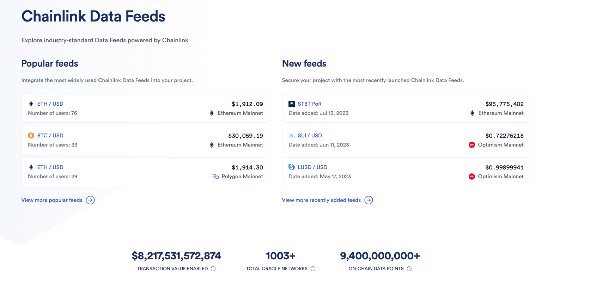
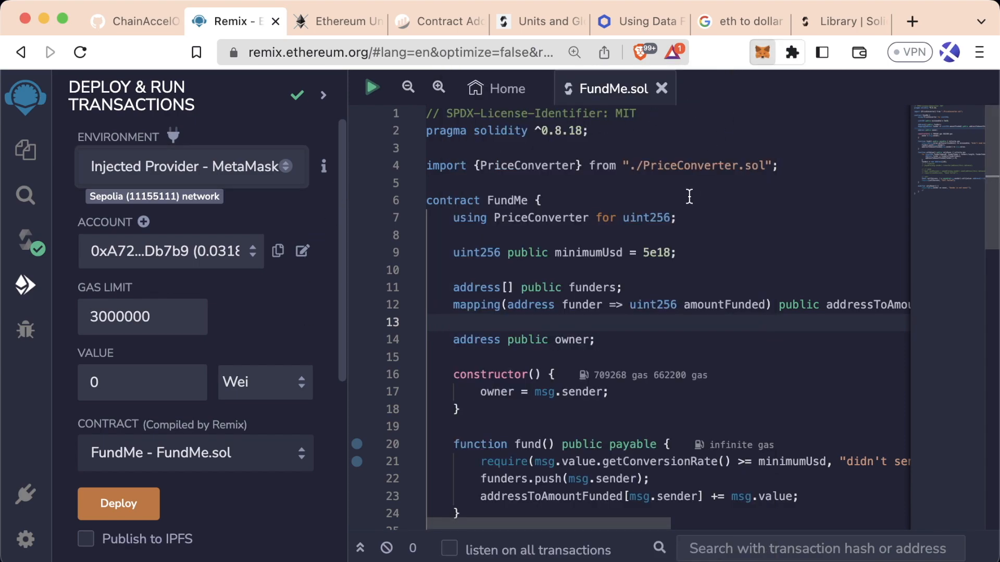

# Remox Fund Me

## Introduction

For this project, we will be using two contracts: `FundMe`, the main crowdfunding contract, and `PriceConverter`. They function much like _Kickstarter_, allowing users to **send** any native blockchain cryptocurrency. They also enable the owner of the contract to **withdraw** all the funds collected. We will then deploy these contracts on a **testnet**.

> 🗒️ **NOTE**: <br />
> Use testnet sparingly. Limiting testnet transactions helps prevent network congestion, ensuring a smoother testing experience for everyone.

### fund and withdraw

Once `FundMe` is deployed on Remix, you'll notice a set of _functions_, including a new red button labelled `fund`, indicating that the function is _payable_. A payable function allows you to send native blockchain currency (e.g., Ethereum, Polygon, Avalanche) to the contract.

We'll additionally indicate a **minimum USD amount** to send to the contract when the function `fund` is called. To transfer funds to the `FundMe` contract, you can navigate to the _value section_ of the Remix deployment tab, enter a value (e.g. 0.1 ether) then hit `fund`. A MetaMask transaction confirmation will appear, and the contract balance will remain zero until the transaction is finalized. Once completed, the contract balance will be updated to reflect the transferred amount.

The contract owner can then `withdraw` the funds. In this case, since we own the contract, the balance will be removed from the contract's balance and transferred to our wallet.

## Project Setup

Let's begin by coding `FundMe`, a crowdfunding contract allowing users to send funds, which the owner can later withdraw. Before we start, let's clean up our Remix IDE workspace

### Setting up the project

Start from scratch by opening your [Remix IDE](https://remix.ethereum.org/) and deleting all existing contracts. Next, create a new contract named `FundMe`.

> 👀❗**IMPORTANT**: <br />
> Before you start coding, try to write down in plain English what you want your code to achieve. This helps clarify your goals and structure your approach.

We want `FundMe` to perform the following tasks:

1. **Allow users to send funds into the contract:** users should be able to deposit funds into the 'FundMe' contract
2. **Enable withdrawal of funds by the contract owner:** the account that owns `FundMe` should have the ability to withdraw all deposited funds
3. **Set a minimum funding value in USD:** there should be a minimum amount that can be deposited into the contract

Let's outline the core structure of the contract:

```solidity
// SPDX-License-Identifier: MIT
pragma solidity ^0.8.18;
contract FundMe {}
```

### fund and withdraw functions

The FundMe contract will have two primary functions that serve as the main interaction points:

1. **`fund`:** allows users to deposit funds into the contract
2. **`withdraw`:** grants the contract owner the ability to withdraw the funds that have been previously deposited

First, let's code the `fund` function and leave the `withdraw` function commented out for the moment.

```solidity
contract FundMe {
    // send funds into our contract
    function fund() public {}
    // owner can withdraw funds
    /*function withdraw() public {}*/
}
```

## Sending Eth through a function

In this part, we'll explore how to transfer Ethereum (ETH) to a smart contract by creating a `fund` function. This function will require a _minimum amount of ETH_ to ensure proper transaction handling.

### value and payable

When a transaction it's sent to the blockchain, a **value** field is always included in the _transaction data_. This field indicates the **amount** of the native cryptocurrency being transferred in that particular transaction.
For the function `fund` to be able to receive Ethereum, it must be declared **`payable`**. In the Remix UI, this keyword will turn the function red, signifying that it can accept cryptocurrency.

_Wallet addresses_ and _smart contracts_ are capable of **holding** and **managing** cryptocurrency funds. These entities can interact with the funds, perform transactions, and maintain balance records, just like a wallet.

```js
function fund() public payable {
    // allow users to send $
    // have a minimum of $ sent
    // How do we send ETH to this contract?
    msg.value;

    //function withdraw() public {}
}
```

In Solidity, the **value** of a transaction is accessible through the [`msg.value`](https://docs.soliditylang.org/en/develop/units-and-global-variables.html#special-variables-and-functions) **property**. This property is part of the _global object_ `msg`. It represents the amount of **Wei** transferred in the current transaction, where _Wei_ is the smallest unit of Ether (ETH).

### Reverting transactions

We can use the`require` keyword as a checker, to enforce our function to receive a minimum `value` of one (1) whole ether:

```js
require(msg.value > 1e18); // 1e18 = 1 ETH = 1 * 10 ** 18
```

This `require` condition ensures that the transaction meets the minimum ether requirements, allowing the function to execute only if this threshold is satisfied. If the specified requirement is not met, the transaction will **revert**.

The require statement in Solidity can include a custom error message, which is displayed if the condition isn't met, clearly explaining the cause of the transaction failure:

```js
require(msg.value > 1 ether, "Didn't send enough ETH"); //if the condition is false, revert with the error message
```

An online tool like [Ethconverter](https://eth-converter.com/) can be useful for executing conversions between _Ether_, _Wei_, and _Gwei_.

> 👀❗**IMPORTANT**: <br />
> 1 Ether = 1e9 Gwei = 1e18 Wei

> 🗒️ **NOTE**: <br />
> Gas costs are usually expressed in Gwei

If a user attempts to send less Ether than the required amount, the transaction will **fail** and a _message_ will be displayed. For example, if a user attempts to send 1000 Wei, which is significantly less than one Ether, the function will revert and does not proceed.

## Solidity Reverts

In this lesson, we will dive into how do _transaction reverts_ work, what is _gas_ where is used.

### Revert

Let's start by adding some logic to the `fund` function:

```js
 uint256 public myValue = 1;
 function fund() public {
    myValue = myValue + 2;
 }
```

A _revert_ action **undoes** all prior operations and returns the remaining gas to the transaction's sender. In this `fund` function, `myValue` increases by two (2) units with each successful execution. However, if a revert statement is encountered right after, all actions performed from the start of the function are undone. `myValue` will then reset to its initial state value, or one.

```js
 uint256 public myValue = 1;
 function fund() public {
    myValue = myValue + 2;
    require(msg.value > 1e18, "didn't send enough ETH");
    // a function revert will undo any actions that have been done.
    // It will send the remaining gas back
 }
```

### Gas Usage

> 🔥 **CAUTION**: <br />
> The gas used in the transaction will not be refunded if the transaction fails due to a revert statement. The gas has already been **consumed** because the code was executed by the computers, even though the transaction was ultimately reverted.

Users can specify how much gas they're willing to allocate for a transaction. In the case where the `fund` function will contain a lot of lines of code after the `require` and we did indeed set a limit, the gas which was previously allocated but not used will not be charged to the user

> 🗒️ **NOTE**: <br />
> If a transaction reverts, is defined as failed

### Transaction Fields

During a **value** transfer, a transaction will contain the following fields:

-   **Nonce**: transaction counter for the account
-   **Gas price (wei)**: maximum price that the sender is willing to pay _per unit of gas_
-   **Gas Limit**: maximum amount of gas the sender is willing to use for the transaction. A common value could be around 21000.
-   **To**: _recipient's address_
-   **Value (Wei)**: amount of cryptocurrency to be transferred to the recipient
-   **Data**: 🫙 _empty_
-   **v,r,s**: components of the transaction signature. They prove that the transaction is authorised by the sender.

During a _**contract interaction transaction**_, it will instead be populated with:

-   **Nonce**: transaction counter for the account
-   **Gas price (wei)**: maximum price that the sender is willing to pay _per unit of gas_
-   **Gas Limit**: maximum amount of gas the sender is willing to use for the transaction. A common value could be around 21000.
-   **To**: _address the transaction is sent to (e.g. smart contract)_
-   **Value (Wei)**: amount of cryptocurrency to be transferred to the recipient
-   **Data**: 📦 _the content to send to the_ _**To**_ _address_, e.g. a function and its parameters.
-   **v,r,s**: components of the transaction signature. They prove that the transaction is authorised by the sender.

### Conclusion

**Reverts** and **gas usage** help maintain the integrity of the blockchain state. _Reverts_ will undo transactions when failures occur, while _gas_ enables transactions execution and runs the EVM. When a transaction fails, the gas consumed is not recoverable. To manage this, Ethereum allows users to set the maximum amount of gas they're willing to pay for each transaction.

## Intro to oracles - getting real world price data

With the rapid advancement of blockchain technology and the growing adoption of decentralized finance platforms (DeFi), the necessity to support **multiple digital currencies** has significantly increased. Enabling users to utilize their preferred digital currencies extends market reach and improves the usability of an application.

This lesson will walk you through adding a **currency conversion feature** to the `fundMe` contract and setting **price thresholds** with Chainlink Oracle, a decentralized network for external data.

### USD values

Currently, our contract will require the transaction value to be greater than _one Ethereum (ETH)_. If we want to give the users the flexibility to spend instead 5 USD, we would need to update our contract. We can begin by specifying the new value with a state variable `uint256 public minimumUSD = 5` at the top of the contract.

The next step would be changing the condition inside the `fund` function, to check if the `value` sent is equal to or greater than our `minimumUSD`. However, we are facing a roadblock here: the `minimumUSD` value is in USD while the transaction message value is specified in ETH.

### Decentralized Oracles

The USD price of assets like Ethereum cannot be derived from blockchain technology alone but it is determined by the financial markets. To obtain a correct _price information_, a connection between off-chain and on-chain data is necessary. This is facilitated by a _decentralized Oracle network_.

This blockchain limitation exists because of its **deterministic nature**, ensuring that all nodes univocally reach a consensus. Attempting to introduce external data into the blockchain, will disrupt this consensus, resulting in what is referred to as a _smart contract connectivity issue_ or _the Oracle problem_.

For smart contracts to effectively replace traditional agreements, they must have the capability to interact with **real-world data**.

Relying on a centralized Oracle for data transmission is inadequate as it reintroduces potential failure points. Centralizing data sources can undermine the trust assumptions essential for the blockchain functionality. Therefore, centralized nodes are not enough for external data or computation needs. _Chainlink_ addresses these centralization challenges by offering a decentralized Oracle Network.

### How Chainlink Works

Chainlink is a _modular and decentralized Oracle Network_ that enables the integration of data and external computation into a smart contract. When a smart contract combines on-chain and off-chain data, can be defined as **hybrid** and it can create highly feature-rich applications.

Chainlink offers ready-made features that can be added to a smart contract. And we'll address some of them:

-   **Data Feeds**
-   **Verifiable Random Number**
-   **Automation (previously known as "Keepers")**
-   **Functions**

### Chainlink Data Feeds

_Chainlink Data Feeds_ are responsible for powering over \$50 billion in the DeFi world. This network of Chainlink nodes aggregates data from various **exchanges** and **data providers**, with each node independently verifying the asset price.


They aggregate this data and deliver it to a reference contract, the **price feed contract**, in a single transaction. Each contract will store the pricing details of a specific cryptocurrency



### Chainlink VRF

The Chainlink VRF (Verifiable Random Function) provides a solution for generating **provably random numbers**, ensuring true fairness in applications such as NFT randomization, lotteries, and gaming. These numbers are determined off-chain, and they are immune to manipulation.


### Chainlink Automation (previously known as "Keepers")

Another great feature is Chainlink's system of _Keepers_. These **nodes** listen for specific events and, upon being triggered, automatically execute the intended actions within the calling contract.

### Chainlink Function

Finally, _Chainlink Functions_ allow **API calls** to be made within a decentralized environment. This feature is ideal for creating innovative applications and is recommended for advanced users with a thorough understanding of Chainlink ecosystem.

### Conclusion

_Chainlink Data Feeds_ will help integrate currency conversion inside of our `FundMe` contract. Chainlink's decentralized Oracle network not only addresses the 'Oracle problem', but provides a suite of additional features for enhancing every dApp capabilities.

## Solidity Interfaces

In this part, we'll learn how to **convert** Ethereum (ETH) into Dollars (USD) and how to use **Interfaces**.

### Converting Ethereum into USD

We begin by trying to convert the `msg.value`, which is now specified in ETH, into USD. This process requires fetching the **current USD market price** of Ethereum and using it to convert the `msg.value` amount into USD.

```solidity
// Function to get the price of Ethereum in USD
function getPrice() public {}

// Function to convert a value based on the price
function getConversionRate() public {}
```

### Chainlink Data Feed

Our primary source for Ethereum prices is a **Chainlink Data Feed**. [Chainlink Data Feed documentation](https://docs.chain.link/data-feeds/using-data-feeds) provides an example of how to interact with a Data Feed contract:

1. `AggregatorV3Interface`: a contract that takes a _Data Feed address_ as input. This contract maintains the ETH/USD price updated.
2. `latestRoundData`: a function that returns an `answer`, representing the latest Ethereum price.

To utilize the **Price Feed Contract**, we need its address and its ABI. The address is available in the Chainlink documentation under the [Price Feed Contract Addresses](https://docs.chain.link/data-feeds/price-feeds/addresses). For our purposes, we'll use ETH/USD price feed.

### Interface

To obtain the ABI, you can import, compile, and deploy the PriceFeed contract itself. In the previous section, we imported the `SimpleStorage` contract into the `StorageFactory` contract, deployed it, and only then we were able to use its functions.

An alternative method involves the use of an **Interface**, which defines methods signature without their implementation logic. If compiled, the Price Feed Interface, it would return the ABI of the Price Feed contract itself, which was previously deployed on the blockchain. We don't need to know anything about the function implementations, only knowing the `AggregatorV3Interface` methods will suffice. The Price Feed interface, called `Aggregator V3 Interface`, can be found in [Chainlink's GitHub repository](https://github.com/smartcontractkit/chainlink/blob/develop/contracts/src/v0.8/shared/interfaces/AggregatorV3Interface.sol).

> 🗒️ **NOTE**: <br />
> Interfaces allow different contracts to interact seamlessly by ensuring they share a common set of functionalities.

We can test the Interface usage by calling the `version()` function:

```solidity
function getVersion() public view returns (uint256) {
    return AggregatorV3Interface(0x5f4eC3Df9cbd43714FE2740f5E3616155c5b8419).version();
}
```

> 🗒️ **NOTE**: <br />
> It's best to work on testnets only after your deployment is complete, as it can be time and resource consuming.

### Conclusion

Using interfaces is a common and effective way to interact with external contracts. First, obtain the interface of the external contract, compile it to get the ABI, and then use the deployed contract's address. This allows you to call any function available at that address seamlessly.

## Importing libaries from NPM and Github

As we delve into smart contract development, **interacting** with external smart contracts will become increasingly frequent. This can involve the use of multiple interfaces, which can clog up the source code and make it difficult to read.

### Interfaces

Let's take a look at the `SmartContract` interface as an example:

```solidity
interface SmartContract {
    function someFunction() external view returns(uint, uint){};
}
```

To include this contract, we simply use the `import "./SimpleStorage.sol"` statement at the top of our file. Instead, if the project is not stored locally, we can use imports from Github.

### Direct Imports from GitHub

Smart Contracts _hosted on GitHub_ can be imported directly into your project. For instance, consider the `AggregatorV3Interface` contract from Chainlink, which is located in Chainlink's GitHub repository and not in our project's directory.

Instead of manually copying all its code into your project and then importing it like this:

```solidity
import { AggregatorV3Interface } from "./AggregatorV3Interface.sol";
```

we can import it more efficiently, as specified in the [Chainlink documentation](https://docs.chain.link/docs/using-chainlink-reference-contracts):

```solidity
import { AggregatorV3Interface } from "@chainlink/contracts/src/v0.8/shared/interfaces/AggregatorV3Interface.sol";
```

This import statement includes the **path** to the AggregatorV3Interface.sol file in the GitHub repository, allowing you to directly import the contract from GitHub or NPM (Node Package Manager).

### Importing from NPM

The `@chainlink/contracts` package, available on NPM, follows **Semantic Versioning (SemVer)**, which allows you to download and use specific versions in your contracts (e.g., `npm install @chainlink/contracts@1.2.3`) while being directly _synchronized_ with Chainlink's GitHub repository. The rest of the import path specifies the exact file that Remix should use.

Remix interprets `@chainlink/contracts` as a reference to the [NPM package](https://www.npmjs.com/package/@chainlink/contracts), and downloads all the necessary code from it.

```solidity
pragma solidity ^0.8.18;
import {AggregatorV3Interface} from "@chainlink/contracts/src/v0.8/shared/interfaces/AggregatorV3Interface.sol";
contract FundMe {}
```

### Conclusion

Efficiently managing external smart contracts is crucial in smart contract development to maintain _clean and readable_ source code. Utilizing **direct imports** from GitHub and NPM, as shown with Chainlink's AggregatorV3Interface, simplifies this process.

## Getting real world price data from Chainlink

The `AggregatorV3Interface` provides a streamlined ABI for interacting with the Data Feed contract. In this lesson, we'll explore how to retrieve pricing information from it.

### Creating a New Contract Instance

The `AggregatorV3Interface` includes the `latestRoundData` function, which retrieves the latest cryptocurrency price from the specified contract. We'll start by declaring a new variable, `priceFeed`, of type `AggregatorV3Interface`. This interface requires the address of the Data Feed contract deployed on the Sepolia Network.

```solidity
AggregatorV3Interface priceFeed = AggregatorV3Interface(0x1b44F3514812d835EB1BDB0acB33d3fA3351Ee43);
```

### The `latestRoundData` Function

We can call the `latestRoundData()` function on this interface to obtain several values, including the latest price.

```solidity
function latestRoundData() external view returns (uint80 roundId, int256 answer, uint256 startedAt, uint256 updatedAt, uint80 answeredInRound);
```

For now, we'll focus on the `answer` value and ignore the other returned values by using commas as placeholders for the unneeded variables.

```solidity
function getLatestPrice() public view returns (int) {
    (,int price,,,) = priceFeed.latestRoundData();
    return price;
}
```

Our `getLatestPrice()` function now retrieves the latest ETH price in USD from the `latestRoundData()` function of the Data Feed contract. The returned price is an `int256` with a precision of 1e8, as indicated by the `decimals` function.

### Decimals

-   `msg.value` is a `uint256` value with 18 decimal places.
-   `answer` is an `int256` value with 8 decimal places (USD-based pairs use 8 decimal places, while ETH-based pairs use 18 decimal places).

This means the `price` returned from our `latestRoundData` function isn't directly compatible with `msg.value`. To match the decimal places, we multiply `price` by 1e10:

```solidity
return price * 1e10;
```

### Typecasting

Typecasting, or type conversion, involves converting a value from one data type to another. In Solidity, not all data types can be converted due to differences in their underlying representations and the potential for data loss. However, certain conversions, such as from `int` to `uint`, are allowed.

```solidity
return uint(price) * 1e10;
```

We can finalize our `view` function as follows:

```solidity
function getLatestPrice() public view returns (uint256) {
    (,int answer,,,) = priceFeed.latestRoundData();
    return uint(answer) * 1e10;
}
```

### Conclusion

This complete `getLatestPrice` function retrieves the latest price, adjusts the decimal places, and converts the value to an unsigned integer, making it compatible for its use inside other functions.

## Solidity Math

In this lesson, we will guide you through converting the value of ETH to USD. We'll use the previously defined `getPrice` function within the new `getConversionRate` function.

### The `getPrice` and `getConversionRate` Functions

The `getPrice` function returns the current value of Ethereum in USD as a `uint256`.\
The `getConversionRate` function converts a specified amount of ETH to its USD equivalent.

### Decimal Places

In Solidity, only integer values are used, as the language does not support floating-point numbers.

```solidity
function getConversionRate(uint256 ethAmount) internal view returns (uint256) {
    uint256 ethPrice = getPrice();
    uint256 ethAmountInUsd = (ethPrice * ethAmount) / 1e18;
    return ethAmountInUsd;
}
```

> 🗒️ **NOTE**: <br />
> The line `uint256 ethAmountInUsd = (ethPrice * ethAmount)` results in a value with a precision of 1e18 \* 1e18 = 1e36. To bring the precision of `ethAmountInUsd` back to 1e18, we need to divide the result by 1e18.

> 🔥 **CAUTION**: <br />
> Always multiply before dividing to maintain precision and avoid truncation errors. For instance, in floating-point arithmetic, `(5/3) * 2` equals approximately 3.33. In Solidity, `(5/3)` equals 1, which when multiplied by 2 yields 2. If you multiply first `(5*2)` and then divide by 3, you achieve better precision.

### Example of `getConversionRate`

-   `ethAmount` is set at 1 ETH, with 1e18 precision.
-   `ethPrice` is set at 2000 USD, with 1e18 precision, resulting in 2000e18.
-   `ethPrice * ethAmount` results in 2000e36.
-   To scale down `ethAmountInUsd` to 1e18 precision, divide `ethPrice * ethAmount` by 1e18.

### Checking Minimum USD Value

We can verify if users send at least 5 USD to our contract:

```solidity
require(getConversionRate(msg.value) >= MINIMUM_USD, "You need to spend more ETH!");
```

Since `getConversionRate` returns a value with 18 decimal places, we need to multiply `5` by `1e18`, resulting in `5 * 1e18` (equivalent to `5 * 10**18`).

### Deployment to the Testnet

In Remix, we can deploy the `FundMe` contract to a testnet. After deployment, the `getPrice` function can be called to obtain the current value of Ethereum. It's also possible to send money to this contract, and an error will be triggered if the ETH amount is less than 5 USD.

```markdown
Gas estimation failed. Error execution reverted, didn't send enough ETH.
```

### Conclusion

In this lesson, we've demonstrated how to convert ETH to USD using the `getConversionRate` function, ensuring precise calculations by handling decimal places correctly.

## Msg Sender

In this lesson, we will learn how to track addresses that are funding the contract and the amounts they will send to it.

### Tracking Funders

To track the addresses are sending money to the contract, we can create an array of addresses named `funders`:

```js
address[] public funders;
```

Whenever someone sends money to the contract, we will add their address to the array with the `push` function:

```js
funders.push(msg.sender);
```

The `msg.sender` global variable refers to the address that **initiates the transaction**.

### Mapping Users to Funds Sent

We can also map each funder's address to the amount they have sent using **mappings**. Let's define a mapping in Solidity:

```js
mapping(address => uint256) public addressToAmountFunded;
mapping (address funder => uint256 amountFunded) public addressToAmountFunded;
```

The `addressToAmountFunded` mapping associates each funder's address with the total amount they have contributed. When a new amount is sent, we can add it to the user's total contribution:

```js
addressToAmountFunded[msg.sender] += msg.value;
```

### Conclusion

We have successfully implemented a system to track users who fund the `fundMe` contract. This mechanism records every address that is sending ETH to the contract, and maps the sender's address to the total amount they have contributed.

## Create Library

In the previous lesson, we used the `getPrice()` function and `getConversionRate`. These methods can be reused multiple times for anyone working with Price Feeds. When a functionality can be _commonly used_, we can create a **library** to efficiently manage repeated parts of codes.

### Libraries

Great examples of Libraries can be found in the [Solidity by example](https://solidity-by-example.org/library/) website.
Solidity libraries are similar to contracts but do not allow the declaration of any **state variables** and **cannot receive ETH**.

> 👀❗**IMPORTANT**: <br />
> All functions in a library must be declared as `internal` and are embedded in the contract during compilation. If any function is not marked as such, the library cannot be embedded directly, but it must be deployed independently and then linked to the main contract.

We can start by creating a new file called `PriceConverter.sol`, and replace the `contract` keyword with `library`.

```solidity
// SPDX-License-Identifier: MIT
pragma solidity ^0.8.18;
library PriceConverter {}
```

Let's copy `getPrice`, `getConversionRate`, and `getVersion` functions from the `FundMe.sol` contract into our new library, remembering to import the `AggregatorV3Interface` into `PriceConverter.sol`. Finally, we can mark all the functions as `internal`.

```solidity
// SPDX-License-Identifier: MIT
pragma solidity ^0.8.18;

import {AggregatorV3Interface} from "@chainlink/contracts/src/v0.8/shared/interfaces/AggregatorV3Interface.sol";

library PriceConverter {
    function getPrice() internal view returns (uint256) {
        AggregatorV3Interface priceFeed = AggregatorV3Interface(0x694AA1769357215DE4FAC081bf1f309aDC325306);
        (, int256 answer, , , ) = priceFeed.latestRoundData();
        return uint256(answer * 10000000000);
    }

    function getConversionRate(uint256 ethAmount) internal view returns (uint256) {
        uint256 ethPrice = getPrice();
        uint256 ethAmountInUsd = (ethPrice * ethAmount) / 1000000000000000000;
        return ethAmountInUsd;
    }
}
```

### Accessing the Library

You can import the library in your contract and attach it to the desired type with the keyword `using`:

```solidity
import {PriceConverter} from "./PriceConverter.sol";
using PriceConverter for uint256;
```

The `PriceConverter` functions can then be called as if they are native to the `uint256` type. For example, calling the `getConversionRate()` function will now be changed into:

```solidity
require(msg.value.getConversionRate() >= minimumUsd, "didn't send enough ETH");
```

Here, `msg.value`, which is a `uint256` type, is extended to include the `getConversionRate()` function. The `msg.value` gets passed as the first argument to the function. If additional arguments are needed, they are passed in parentheses:

```solidity
uint256 result = msg.value.getConversionRate(123);
```

In this case, `123` is passed as the second `uint256` argument to the function.

### Conclusion

In this lesson, we explored the benefits of using _libraries_ to reuse code and add new functionalities. We created a `PriceConverter` library to handle `getPrice`, `getConversionRate`, and `getVersion` functions, demonstrating how to structure and utilize libraries effectively.

## SafeMath

In this lesson, we will explore `SafeMath`, a widely used library before Solidity version 0.8, and understand why its usage has now decreased.

### Integer Overflow

`SafeMath.sol` was a staple in Solidity contracts before version 0.8. After this version, its usage has significantly dropped.

Let's begin by creating a new file called `SafeMathTester.sol` and adding a function `add` that increments the `bigNumber` state variable.

```solidity
// SafeMathTester.sol
pragma solidity ^0.6.0;

contract SafeMathTester {
    uint8 public bigNumber = 255;

    function add() public {
        bigNumber = bigNumber + 1;
    }
}
```

Notice we are using compiler version `0.6.0`. The `bigNumber` is a `uint8` variable with a maximum value of `255`. If we call the `add` function, it will return `0` instead of the expected `256`.

Before Solidity version **0.8.0**, signed and unsigned integers were **unchecked**, meaning that if they exceeded the maximum value the variable type could hold, they would reset to the lower limit. This pattern is known as **integer overflow** and the `SafeMath` library was designed to prevent it.

### SafeMath

`SafeMath.sol` provided a mechanism to revert transactions when the maximum limit of a `uint256` data type was reached. It was a typical security measure across contracts to avoid erroneous calculations and potential exploits.

```solidity
function add(uint a, uint b) public pure returns (uint) {
    uint c = a + b;
    require(c >= a, "SafeMath: addition overflow");
    return c;
}
```

### Solidity 0.8.0

With the introduction of Solidity version 0.8, automatic checks for overflows and underflows were implemented, making `SafeMath` redundant for these checks. If `SafeMathTester.sol` is deployed with Solidity `0.8.0`, invoking the `add` function will cause a transaction to fail, when, in older versions, it would have reset to zero.

For scenarios where mathematical operations are known not to exceed a variable's limit, Solidity introduced the `unchecked` construct to make code more _gas-efficient_. Wrapping the addition operation with `unchecked` will _ignore the overflow and underflow checks_: if the `bigNumber` exceeds the limit, it will wrap its value to zero.

```solidity
uint8 public bigNumber = 255;

function add() public {
    unchecked {
        bigNumber = bigNumber + 1;
    }
}
```

> 🔥 **CAUTION**: <br />
> It's important to use unchecked blocks with caution as they reintroduce the possibility of overflows and underflows.

### Conclusion

The evolution of Solidity and `SafeMath.sol` highlights the continuous advancements in Ethereum smart contract development. Although recent updates have made `SafeMath.sol` less essential, it remains a significant part of Ethereum's history. Understanding its role provides valuable insight into the progress and maturation of Solidity.

## Solidity For loop

In this tutorial, we'll set up the `withdraw` function to enable the retrieval of accumulated funds. We'll then reset all the mappings to zero using a method known as a **for loop**.

### For Loops

A _for loop_ is a widely-used concept in many programming languages that enables the execution of a block of code a _repeated amount of times_.

For example, consider this list:

```Solidity
//[1, 2, 3, 4] elements
// 0  1  2  3  indexes
```

The elements of the list are the numbers 1 through 4, with indices ranging from 0 to 3: the number 1 is at index 0, the number 2 is at index 1, and so on. To access all the elements in this list, we can use their **indexes**.

A typical `for` loop structure in programming languages involves:

1. Initializing at some starting index
2. Iterating until an end index
3. Incrementing by certain steps

For instance, if we start the loop at index 0, end at index 10, and increment by 1 each time, we'll get:

```Solidity
0, 1, 2, 3, 4, 5, 6, 7, 8, 9, 10
```

However, if we start at index 3, end at index 12, and increment by 2 each time, we get:

```Solidity
3, 5, 7, 9, 11
```

### Using for Loops in the FundMe Contract

To implement this concept in the `FundMe` contract:

```js
uint256 funderIndex;
for (funderIndex = 0; funderIndex < funders.length; funderIndex++) {
    address funder = funders[funderIndex];
    addressToAmountFunded[funder] = 0;
}
```

The loop begins at index 0 and goes through all the elements in the `funders` array until it reaches the final element. With each iteration, it performs the following actions:

1. Accesses the `funder` address at the current index
2. Resets the corresponding funding amount in the `addressToAmountFunded` mapping to zero, clearing the `funder`'s record.

> 🗒️ **NOTE**:br
> The **addressToAmountFunded** map connects addresses with the respective amounts they funded.

### Shortcuts

Additionally, we have used two shorthands in our code:

1. `funderIndex++`: shorthand for `funderIndex = funderIndex + 1`.
2. `+=`: adds a value to an existing one. `x = x + y` is equivalent to `x += y`.

To illustrate the code snippet, we start from `funderIndex` 0. When entering the loop, we get the address of the funder at the 1st position in the `funders` array and set its amount to zero. After that, we repeat the loop, incrementing the `funderIndex` by 1 and checking whether it is still less than the total number of funders. We then get the address of the funder at the next position and so on.

### Conclusion

In this lesson, we learned how to implement the `withdraw` function to manage accumulated funds and reset mappings using a `for loop`. This process ensures efficient handling of funders' records.

## Resetting an Array

The simplest way to reset the `funders` array is similar to the method used with the mapping: iterate through all its elements and reset each one to 0. Alternatively, we can create a brand new `funders` array.

```js
funders = new address[](0);
```

> 🗒️ **NOTE**:br
> You might recall using the `new` keyword when deploying a contract. In this context, however, it resets the `funders` array to a zero-sized, blank address array.

## Sending Eth through a Contract

This lesson explores three different methods of sending ETH from one account to another: `transfer`, `send`, and `call`. We will understand their differences, how each one works, and when to use one instead of another.

### Transfer

The `transfer` function is the simplest way to send Ether to a recipient address:

```solidity
payable(msg.sender).transfer(amount); // the current contract sends the Ether amount to the msg.sender
```

It's necessary to convert the recipient address to a **payable** address to allow it to receive Ether. This can be done by wrapping `msg.sender` with the `payable` keyword.

However, `transfer` has a significant limitation. It can only use up to 2300 gas and it reverts any transaction that exceeds this gas limit, as illustrated by [Solidity by Example](https://solidity-by-example.org/sending-ether/).

### Send

The `send` function is similar to `transfer`, but it differs in its behaviour:

```solidity
bool success = payable(msg.sender).send(address(this).balance);
require(success, "Send failed");
```

Like `transfer`, `send` also has a gas limit of 2300. If the gas limit is reached, it will not revert the transaction but return a boolean value (`true` or `false`) to indicate the success or failure of the transaction. It is the developer's responsibility to handle failure correctly, and it's good practice to trigger a **revert** condition if the `send` returns `false`.

### Call

The `call` function is flexible and powerful. It can be used to call any function **without requiring its ABI**. It does not have a gas limit, and like `send`, it returns a boolean value instead of reverting like `transfer`.

```solidity
(bool success, ) = payable(msg.sender).call{value: address(this).balance}("");
require(success, "Call failed");
```

To send funds using the `call` function, we convert the address of the receiver to `payable` and add the value inside curly brackets before the parameters passed.

The `call` function returns two variables: a boolean for success or failure, and a byte object which stores returned data if any.

> 👀❗**IMPORTANT**:br
> `call` is the recommended way of sending and receiving Ethereum or other blockchain native tokens.

### Conclusion

In conclusion, _transfer_, _send_, and _call_ are three unique methods for transferring Ether in Solidity. They vary in their syntax, behaviour, and gas limits, each offering distinct advantages and drawbacks.

## constructor function

Currently, **anyone** can call the `withdraw` function and drain all the funds from the contract. To fix this, we need to **restrict** the withdrawal function to the contract owner.

One solution could be to create a function, `callMeRightAway`, to assign the role of contract owner to the contract's creator immediately after deployment. However, this requires two transactions.

A more efficient solution is to use a **constructor** function:

```solidity
constructor() {}
```

> 🗒️ **NOTE**:br
> The constructor does not use the `function` and `public` keywords.

### Assigning the Owner in the Constructor

The constructor function is automatically called during contract deployment, within the same transaction that deploys the contract.

We can use the constructor to set the contract's owner immediately after deployment:

```solidity
address public owner;
constructor() {
    owner = msg.sender;
}
```

Here, we initialize the state variable `owner` with the contract deployer's address (`msg.sender`).

### Modifying the Withdraw Function

The next step is to update the `withdraw` function to ensure it can only be called by the owner:

```solidity
function withdraw() public {
    require(msg.sender == owner, "must be owner");
    // rest of the function here
}
```

Before executing any withdrawal actions, we check that `msg.sender` is the owner. If the caller is not the owner, the operation **reverts** with the error message "must be the owner" This access restriction ensures that only the intended account can execute the function.

### Conclusion

By incorporating a constructor to assign ownership and updating the withdraw function to restrict access, we have significantly improved the security of the fundMe contract. These changes ensure that only the contract owner can withdraw funds, preventing unauthorized access.

## Modifiers

In this lesson, we will explore **modifiers** and how they can simplify code writing and management in Solidity. Modifiers enable developers to create reusable code snippets that can be applied to multiple functions, enhancing code readability, maintainability, and security.

### Repeated Conditions

If we build a contract with multiple _administrative functions_, that should only be executed by the contract owner, we might repeatedly check the caller identity:

```solidity
require(msg.sender == owner, "Sender is not owner");
```

However, repeating this line in every function clutters the contract, making it harder to read, maintain, and debug.

### Modifiers

Modifiers in Solidity allow embedding **custom lines of code** within any function to modify its behaviour.

Here's how to create a modifier:

```solidity
modifier onlyOwner {
    require(msg.sender == owner, "Sender is not owner");
    _;
}
```

> 🗒️ **NOTE**:br
> The modifier is named `onlyOwner` to reflect the condition it checks.

### The `_` (underscore)

The underscore `_` placed in the body is a placeholder for the modified function's code. When the function with the modifier is called, the code before `_` runs first, and if it succeeds, the function's code executes next.

For example, the `onlyOwner` modifier can be applied to the `withdraw` function like this:

```solidity
function withdraw(uint amount) public onlyOwner {
    // Function logic
}
```

When `withdraw` is called, the contract first executes the `onlyOwner` modifier. If the `require` statement passes, the rest of the `withdraw` function executes.

If the underscore `_` were placed before the `require` statement, the function's logic would execute first, followed by the `require` check, which is not the intended use case.

### Conclusion

Using modifiers like `onlyOwner` simplifies contract development by centralizing common conditions, reducing code repetition, and enhancing contract readability and maintainability.

## Test the smart contract

In this lesson, we'll delve into _end-to-end testing_ of a Solidity contract's deployment and execution.

### Deployment Transaction

First, we need to _compile_ the contract to ensure the code is correct. On Remix, set the **injected provider** to MetaMask and confirm it is properly synced to the testnet. Ensure you have some Sepolia Ether (ETH) in your wallet if you plan to deploy the contract on Sepolia.



We'll deploy the `FundMe` contract by clicking deploy and then confirming the transaction in MetaMask, which may take some time.

### Contract Interaction

After successfully deploying the `FundMe` contract, you'll see several buttons to interact with it:

-   **Red button**: Payable functions (e.g., `fund`)
-   **Orange button**: Non-payable functions (e.g., `withdraw`)
-   **Blue buttons**: `view` and `pure` functions

The `fund` function allows us to send ETH to the contract (minimum 5 USD). The `owner` of the contract is our MetaMask account, as the **constructor** sets the deployer as the owner.

> 🗒️ **NOTE**:br
> If the `fund` function is called without any value or with less than 5 USD, you will encounter a gas estimation error, indicating insufficient ETH, and gas will be wasted.

### Successful Transaction

If you set the amount to `0.1 ETH` and confirm it in MetaMask, you can then track the successful transaction on Etherscan. In the Etherscan transaction log, you will see that the `fundMe` balance has increased by `0.1 ETH`. The `funders` array will register your address, and the mapping `addressToAmountFunded` will record the amount of ETH sent.

### Withdraw Function and Errors

After funding the contract, we can initiate the `withdraw` function. This function can only be called by the owner; if a non-owner account attempts to withdraw, a gas estimation error will be thrown, and the function will revert.

Upon successful withdrawal, the `fundMe` balance, the `addressToAmountFunded` mapping, and the `funders` array will all reset to zero.

### Conclusion

In this lesson, we've explored the end-to-end process of deploying and interacting with a Solidity contract using Remix and MetaMask. We covered the deployment transaction, contract interaction, and how to handle successful transactions and potential errors.

## Immutability and Constants

In this lesson, we'll explore tools to optimize **gas usage** for variables that are set only _once_.

### Optimizing Variables

The variables `owner` and `minimumUSD` are set one time and they never change their value: `owner` is assigned during contract creation, and `minimumUSD` is initialized at the beginning of the contract.

### Evaluating the FundMe Contract

We can evaluate the gas used to create the contract by deploying it and observing the transaction in the terminal. In the original contract configuration, we spent almost 859,000 gas.

### Constant

To reduce gas usage, we can use the keywords `constant` and `immutable`. These keywords ensure the variable values remain unchanged. For more information, you can refer to the [Solidity documentation](https://solidity.readthedocs.io/).

We can apply these keywords to variables assigned once and never change. For values known at **compile time**, use the `constant` keyword. It prevents the variable from occupying a storage slot, making it cheaper and faster to read.

Using the `constant` keyword can save approximately 19,000 gas, which is close to the cost of sending ETH between two accounts.

> 🗒️ **NOTE**:br
> Naming conventions for `constant` are all caps with underscores in place of spaces (e.g., `MINIMUM_USD`).

> 🚧 **WARNING**:br
> Converting the current ETH gas cost to USD, we see that when ETH is priced at 3000 USD, defining `MINIMUM_USD` as a constant costs 9 USD, nearly 1 USD more than its public equivalent.

### Immutable

While `constant` variables are for values known at compile time, `immutable` can be used for variables set at deployment time that will not change. The naming convention for `immutable` variables is to add the prefix `i_` to the variable name (e.g., `i_owner`).

Comparing gas usage after making `owner` an `immutable` variable, we observe similar gas savings to the `constant` keyword.

> 💡 **TIP**:br
> Don't focus too much on gas optimization at this early stage of learning.

### Conclusion

In this lesson, we have explored the use of `constant` and `immutable` keywords in Solidity to optimize gas usage for variables that are set only once. Understanding how and when to use these keywords can significantly reduce gas costs, making your smart contracts more efficient.


# old

<!--
## Sending ETH

in Deploy and run transactions section in REMIX there is an input calls "**value**", that reperesent how much ethereum we are going to be sending at our transactions.

### Transactions - Fields

1. Nonce=> tx count for the account
2. Gas Price=> price per unit of gas (in wei)
3. Gas Limit => max gas that this tx can use
4. To: address that the tx is send to
5. Value => amount of wei to send
6. Data => what to send to the To address
7. v,r,s => components of the signature [learn more](https://ethereum.stackexchange.com/questions/15766/what-does-v-r-s-in-eth-gettransactionbyhash-mean)

### Transactions - Value Transfer

1. Nonce=> tx count for the account
2. Gas Price=> price per unit of gas (in wei)
3. Gas Limit => 21000
4. To: address that the tx is send to
5. Value => amount of wei to send
6. Data => empty
7. v,r,s => components of the signature

### Transactions - Function Call

1. Nonce=> tx count for the account
2. Gas Price=> price per unit of gas (in wei)
3. Gas Limit => max gas that this tx can use
4. To => address that the tx is send to
5. Value => amount of wei to send
6. Data => what to send to the To address
7. v,r,s => components of the signature

[learn more about transactions](https://ethereum.org/en/developers/docs/transactions/);

### Payable functions

Functions and addresses declared payable can receive ether into the contract. [learn more](https://solidity-by-example.org/payable/)

```js
    function fundMe() public payable {}
```

-   smart contacts can hold funds just like how wallets can
-   when you make a function "payable" you can accees the value property

### msg

a global keyword variable that has four property. [learn more](https://docs.soliditylang.org/en/latest/cheatsheet.html#block-and-transaction-properties)

1. data (bytes): complete calldata
2. sender (address): sender of the message (current call)
3. sig (bytes4): first four bytes of the calldata (i.e. function identifier)
4. value (uint): number of wei sent with the message

### abort

abort fanction takes a condition and abort execution and revert state changes if condition is false. Also provide error message. [learn more](https://docs.soliditylang.org/en/latest/cheatsheet.html#validations-and-assertions)

```js
require(msg.value > 1e18, "didn't send enough"); // wei unit
```

-   Money math is done in terms of wei so 1 ETH nedds to be set as 1e18 value.

### reverting

undo any action before, and send remaining gas back.

```js
contract FundMe {
    uint256 public number = 0;

    function fundMe() public payable {
        number = 10; // you spend some gas for the computation, not reverting yet
        require(msg.value > 1e18, "Didn't send enough");
        number = 20; // you do not spend gas for the coputation, it is reverted
        // after the reverting the value of number variable is 0
    }
}
```

## ChainLink And Oracle

msg.value is in ETH but we want to send a value in "USD" unit. how to convert it?

There is where chainlink and oracle come into play.

### Blockchain Oracle

Blockchain oracles are entities that connect blockchains to external systems, thereby enabling smart contracts to execute based upon inputs and outputs from the real world. [learn more](https://chain.link/education/blockchain-oracles)

Any device that interfacts with the off-chian world to provide external data or computation to smart contracts.

### The Blockchain Oracle Problem

The blockchain oracle problem refers to the inability of blockchains to access external data, making them isolated networks, akin to a computer with no Internet connection. Bridging the connection between the blockchain (onchain) and the outside world (offchain) requires an additional piece of infrastructure—an oracle. [learn more](https://chain.link/education-hub/oracle-problem)

1. Smart contracts are unable to connect with external systems, data feeds, APIs, existing payment systems or any other off-chain resources on their own.
2. Centralized Oracles are a Point of Failure

### ChainLink

it is a decentralized oracle network to bring data and external computation into our smart contracts. which drives to hybrid smart contracts.

chianlink is a modular, decennterlized oracle network that can be customized to deliver any data or do any exernal computation that you like. [learn more](https://chain.link/)

### ChainLink Data Feeds

a network of chainlink nodes get data from diffrent exchanges and data providers and bring that data throght decentralized chainlink nodes. the chainlink nodes use median to figure out what the actual price of the asset is and deliver that in a single transaction to what's called a reference contract on chain that smart contracts use that pricing information to power their DEFI application. [learn more](https://docs.chain.link/data-feeds/using-data-feeds)

### ChainLink Features

1. chianlink data feeds
2. chainlink VRF (verifiable randomness function) [learn more](https://docs.chain.link/vrf)
3. chainlink keeper [learn more](https://docs.chain.link/chainlink-automation)
4. end-to-end reliability [learn more](https://docs.chain.link/any-api/get-request/introduction) [learn much more](https://docs.chain.link/any-api/introduction)

#### Other links

[Importing Tokens into your Metamask](https://consensys.io/blog/how-to-add-your-custom-tokens-in-metamask)

[Request and Receive Chainlink Model](https://docs.chain.link/architecture-overview/architecture-request-model)

## Interfaces & Price Feeds

You can interact with other contracts by declaring an Interface. [learn more](https://solidity-by-example.org/interface/)

## Importing from GitHub & NPM

[chainlink github](https://github.com/smartcontractkit/chainlink)

[chainlink npm](https://www.npmjs.com/package/@chainlink/contracts)

[AggregatorV3Interface](https://github.com/smartcontractkit/chainlink/blob/develop/contracts/src/v0.8/shared/interfaces/AggregatorV3Interface.sol)

## Floating Point Math in Solidity

[tuple](https://docs.soliditylang.org/en/latest/abi-spec.html#handling-tuple-types)

[Floating Point Numbers in Solidity](https://stackoverflow.com/questions/58277234/does-solidity-supports-floating-point-number)

[Type Casting](https://ethereum.stackexchange.com/questions/6891/type-casting-in-solidity)

## Basic Solidity: Arrays & Structs II

## Library

Libraries are similar to contracts, but you can't declare any state variable and you can't send ether.

A library is embedded into the contract if all library functions are internal.

Otherwise the library must be deployed and then linked before the contract is deployed.

[learn more](https://solidity-by-example.org/library/)

there is a **library** keyword that you can build a library with.

```js
    library PriceConvertor {

    }
```

all the functions in library must be internal.

### Using For

The directive using A for B; can be used to attach functions (A) as member functions to any type (B). These functions will receive the object they are called on as their first parameter (like the self variable in Python). [learn more](https://docs.soliditylang.org/en/v0.8.14/contracts.html?highlight=using#using-for)

## SafeMath, Overflow Checking, and the "unchecked" keyword

in earlier version of solidity if a number reaches the max of its value, if you add to it it will restart.

```js
    uint8 public bigNumber = 255 // the max number of uint8 is 255

    function add() public {
        bigNumber += 1; // it will restart from 0
    }
```

but if you try it in newer version it will give you an error.

to still restrart the code you need to use the "unchecked" keyword

```js
    uint8 public bigNumber = 255

    function add() public {
        unchecked {bigNumber += 1}; // it will restart from 0
    }
```

[Checked or Unchecked Arithmetic](https://docs.soliditylang.org/en/latest/control-structures.html#checked-or-unchecked-arithmetic)

[Math Library](https://github.com/OpenZeppelin/openzeppelin-contracts/blob/master/contracts/utils/math/Math.sol)

## For loop

a way to loop throgh some type of index object or some range of numbers or just do a task a certain amount of times repeating. [learn more](https://solidity-by-example.org/loop/)

```js
    // starting index, ending index, step amount
    for (uint256 i = 0; i < 10; i++) {
        if (i == 3) {
            // Skip to next iteration with continue
            continue;
        }
        if (i == 5) {
            // Exit loop with break
            break;
        }
    }
```

## Resetting an Array

you can reset an array using the below code

```js
    arrayName = new address[](0);
```

## Sending ETH from a Contract

There are 3 ways to send eth. [learn more](https://solidity-by-example.org/sending-ether/)

1. transfer

```js
// msg.sender => address
// payable(msg.sender) => payable address
payable(msg.sender).transfer(address(this).balance); // returns an error and revert if fails
```

2. send

```js
    bool sendSuccess = payable(msg.sender).send(address(this).balance); //returns a bool if fails
    require(sendSuccess, 'Send Fails');
```

3. call

```js
    (bool callSuccess, ) = payable(msg.sender).call{value: address(this).balance}("");; // returns bool and data if fails
    require(callSuccess, 'Call Fails');
```

[learn more about this keyword](https://ethereum.stackexchange.com/questions/1781/what-is-the-this-keyword-in-solidity)

## Constructor

A constructor is an optional function that is executed upon contract creation. [learn more](https://solidity-by-example.org/constructor/)

## Modifiers

Modifiers are code that can be run before and / or after a function call. [learn more](https://solidity-by-example.org/function-modifier/)

Modifiers can be used to:

1. Restrict access
2. Validate inputs
3. Guard against reentrancy hack

```js
    modifier onlyOwner() {
        require(msg.sender == owner, "Not owner");
        _; // Underscore is a special character only used inside a function modifier and it tells Solidity to execute the rest of the code.
    }

    function changeOwner(address _newOwner) public onlyOwner (_newOwner) {
        owner = _newOwner;
    }
```

## Constant

Constants are variables that cannot be modified. Their value is hard coded and using constants can save gas cost. [learn more](https://solidity-by-example.org/constants/)

better to use upercase for constant variables.

```js
contract Constants {
    // coding convention to uppercase constant variables
    address public constant MY_ADDRESS = 0x777788889999AaAAbBbbCcccddDdeeeEfFFfCcCc;
    uint256 public constant MY_UINT = 123;
}
```

## Immutable

Immutable variables are like constants. Values of immutable variables can be set inside the constructor but cannot be modified afterwards. [learn more](https://solidity-by-example.org/immutable/)

```js
contract Immutable {
    // coding convention to uppercase constant variables
    address public immutable MY_ADDRESS;
    uint256 public immutable MY_UINT;

    constructor(uint256 _myUint) {
        MY_ADDRESS = msg.sender;
        MY_UINT = _myUint;
    }
}
```

## Custom Errors

Custom errors are defined using the **error** statement, which can be used inside and outside of contracts (including interfaces and libraries). [learn more](https://soliditylang.org/blog/2021/04/21/custom-errors/)

```js
error Unauthorized();

contract VendingMachine {
    address payable owner = payable(msg.sender);

    function withdraw() public {
        if (msg.sender != owner) revert Unauthorized();

        owner.transfer(address(this).balance);
    }
}
```

## Receive and Fullback functions

1. Receive functions => The receive function is executed on a call to the contract with empty calldata. This is the function that is executed on plain Ether transfers (e.g. via .send() or .transfer()). If no such function exists, but a payable fallback function exists, the fallback function will be called on a plain Ether transfer. If neither a receive Ether nor a payable fallback function is present, the contract cannot receive Ether through a transaction that does not represent a payable function call and throws an exception. [learn more](https://docs.soliditylang.org/en/latest/contracts.html#receive-ether-function)

2. Fallback function => The fallback function is executed on a call to the contract if none of the other functions match the given function signature, or if no data was supplied at all and there is no receive Ether function. The fallback function always receives data, but in order to also receive Ether it must be marked payable. [learn more](https://docs.soliditylang.org/en/latest/contracts.html#fallback-function)

```
    Explainer from: https://solidity-by-example.org/fallback/
    Ether is sent to contract
         is msg.data empty?
             /   \
            yes  no
            /     \
       receive()?  fallback()
        /   \
      yes   no
     /        \
   receive()  fallback()
``` -->
